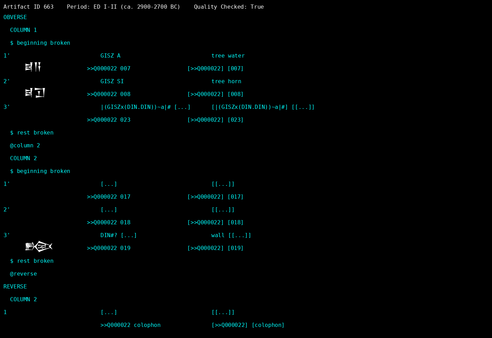

# deep-cuneiform
DeepSeek OCR for cuneiform tablets using LoRA fine-tuning on Sumerian and Akkadian texts.

This project fine-tunes DeepSeek-OCR for recognizing cuneiform script from images, focusing on Early Dynastic to Old Babylonian periods (ca. 2900-1600 BCE).

## Setup

### Prerequisites
- Python 3.11+
- uv (Python package manager): `curl -LsSf https://astral.sh/uv/install.sh | sh`
- Git and Git LFS for data download

### Install Dependencies
```bash
uv sync
```

### Download CDLI Data
The project uses metadata from the CDLI GitHub data dump. Clone it into the `data/` directory:

```bash
git clone https://github.com/cdli-gh/data data/cdli-gh-data
cd data/cdli-gh-data
git lfs fetch --all  # Downloads large files like ATF texts
```

**Note**: This repo is large (~GB). Alternatively, you can download just the catalogue CSV manually from [CDLI's site](https://cdli.ucla.edu/downloads.html) and place `cdli_cat.csv` in `data/cdli-gh-data/`, but the full repo provides additional ATF files for reference.

## Usage

### Download Training Data
Download high-quality Sumerian tablets with images and transliterations, filtered by historical period:

```bash
uv run python tools/download_cdli.py
```

- Focuses on Early Dynastic to Old Babylonian periods
- Requires images and ATF transliterations
- Minimum ATF length for quality
- Resumable downloads with `data/download_state.json`
- Saves images to `data/images/` and ATF to `data/annotations/`

### Lookup Artifacts
Get comprehensive details for a specific artifact by ID:

```bash
uv run python tools/lookup_cdli.py 663
```

- Shows image path, period, quality status
- Displays full ATF transliteration
- Fetches English translation from CDLI API
- Provides attempted Sumerian-to-English translation using dictionaries

### Translate ATF Text
Translate raw ATF files or input using built-in dictionaries:

```bash
uv run python tools/translate_atf.py data/annotations/cdli_P000723.atf
# Or for artifact ID:
uv run python tools/translate_atf.py --id 663
```

- Uses manual Sumerian dictionary (`data/dictionaries/manual_sumerian_dict.txt`)
- Supports Assyrian and proto-cuneiform signs
- Handles compound signs and variants

### Visualize Tablets
Generate PNG images showing tablet structure with cuneiform glyphs, ATF text, and translations:

```bash
uv run python tools/visualize_tablet.py 663
```

- Header with artifact ID, period, quality
- Three-column layout: Line number | Cuneiform glyphs | ATF text | English translation
- Handles @/$ directives as separate lines
- Uses Unicode cuneiform fonts (Noto Sans Cuneiform prioritized)
- Outputs to `data/visualizations/{id}_tablet.png`


*Example visualization of CDLI artifact 663 showing cuneiform glyphs, ATF text, and English translations*

## Data Structure
- `data/images/`: Downloaded tablet images
- `data/annotations/`: ATF transliteration files
- `data/visualizations/`: Generated PNG visualizations
- `data/download_state.json`: Download progress and quality flags
- `data/dictionaries/`: Translation dictionaries (manual Sumerian, proto-cuneiform, etc.)

## Training (GPU Required)
Once sufficient data is downloaded:

```bash
uv run python train.py
```

## Language Coverage

| Flavor | Unicode Support | Works with ATF Mapper |
|--------|-----------------|----------------------|
| Standard Sumerian / Akkadian (Ur III, OB, etc.) | Full (U+12000–U+123FF) | YES – covers ~1,200 signs used in most ATF texts |
| Proto-Cuneiform (ca. 3200 BCE) | No official Unicode block (only a few experimental encodings) | NO – requires LAK or ArchSign fonts + custom PUA mapping |
| Hittite, Hurrian, etc. | Some signs overlap; many are missing | Partial – only shared signs render |
| Emesal / Women's language | Same signs, different readings | YES – transliteration is identical |

**Note**: Proto-cuneiform uses private-use area (PUA) glyphs from fonts like Santakku or LAK. The ATF mapper can be extended with a separate dict for proto signs.

## Notes
- GPU training requires Flash Attention and CUDA libraries (auto-installed via uv).
- Data is sourced from CDLI (Cuneiform Digital Library Initiative).
- ATF to Unicode conversion uses custom mapping via `lib/atf2unicode/main.py`; expand dictionaries for better coverage.
- Visualizations support Unicode cuneiform rendering in compatible viewers.
- Download script automatically resumes interrupted downloads.

### TODO: Fully Parse ATF Compound & Variant Signs

> **Goal**: Convert complex ATF like `|(GISZx(DIN.DIN))~a|#` → `U+12459` (𒑙) + damage marker

#### Current Status
- [x] Simple signs: `GISZ` → `U+12113`
- [x] Basic compounds: `GISZxDIN` → `U+12451`
- [x] Full ATF syntax: `|...|`, `(...)`, `~a`, `#`, `!`, `[...]`


